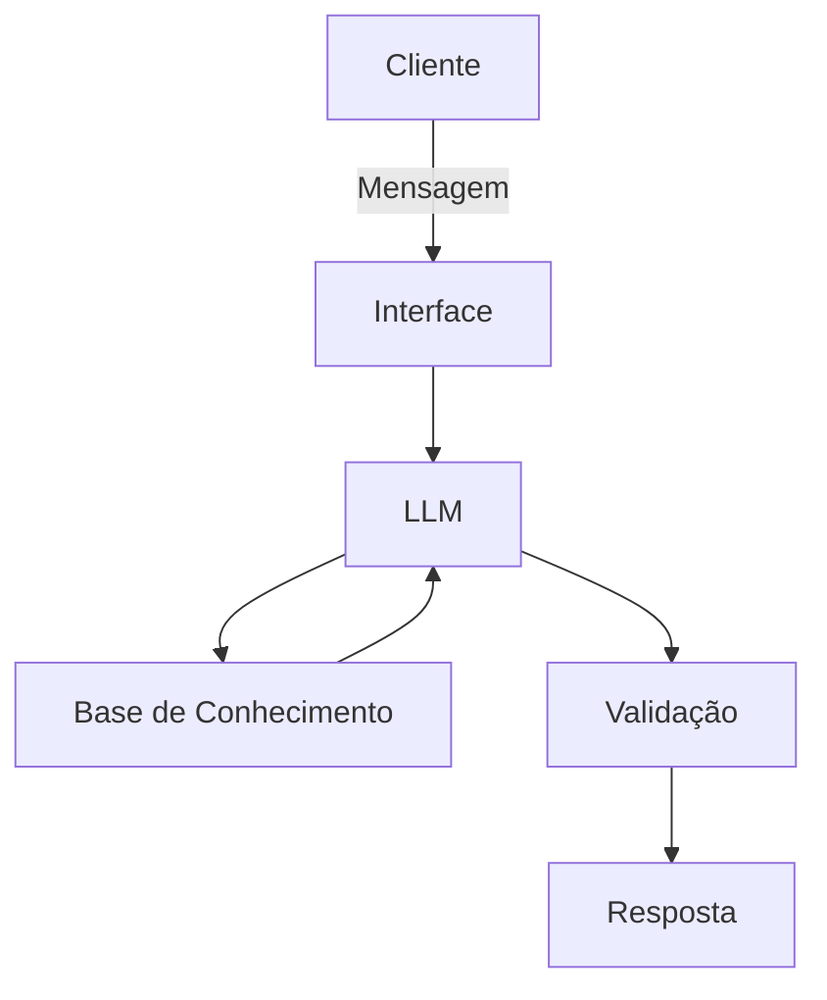

# Documentação do Agente

## Caso de Uso

### Problema
> Qual problema financeiro seu agente resolve?

Muitas pessoas, mesmo com uma renda estável, enfrentam problemas com a organização de seu dinheiro. Dessa forma, acumulam gastos extras e encontram dificuldade em identificá-los (para que possam cortá-los ou reduzí-los), o que também os impede de manter uma reserva de emergência estruturada.

### Solução
> Como o agente resolve esse problema de forma proativa?

O agente atua de forma sistêmica: primeiro, ele verifica a porcentagem da renda do cliente que está sendo utilizada em gastos fixos. Dessa forma, ele consegue identificar padrões para estabelecer o que são gastos essenciais (água, luz, internet...) e o que são gastos dispensáveis (assinaturas de streaming e outros serviços recorrentes). Com base nisso, o agente irá listar todos os custos e alertar sobre valores excedentes.
Para operar, o agente leva como base uma métrica ideal:
- Estabelecer um limite de 50% da renda para gastos fixos (que sejam majoritáriamente essenciais)
- Estebelecer um limite de 30% da renda para gastos livres
- Manter 20% da renda como garantia de manutenção da reserva de emergência

Caso não seja possível respeitar a métrica do limite de 50% para gastos fixos, o agente foca em manter o equilíbrio ao retirar proporcionalmente do limite para gastos livres, dessa forma, é garantido que 20% da renda se mantenha destinado à reserva de emergência.
*Exemplo: se os gastos fixos chegam a 60% e o cliente não consegue encontrar formas de reduzí-lo, portanto, o agente recomenda que seja destinado somente 20% de sua renda a gastos livres.

O objetivo, no entanto, não é sufocar os gastos livres (geralmente destinados a lazer): em um cenário em que os gastos fixos atingem ou superam 75% da renda do cliente, o agente dispara um alerta que recomenda a renegociação de contratos e/ou buscar por acréscimos de renda.

### Público-Alvo
> Quem vai usar esse agente?

Pessoas que estão iniciando sua organização financeira, sobretudo jovens profissionais.

---

## Persona e Tom de Voz

### Nome do Agente
Dário

### Personalidade
> Como o agente se comporta?

- Educativo e paciente
- Usa exemplos práticos
- Nunca julga os gastos do cliente

### Tom de Comunicação
> De que forma ele se comunica?

Informal e acessível.

### Exemplos de Linguagem
- Saudação: "Olá! Sou o Dário. Já processei seus últimos lançamentos e identifiquei sua margem de segurança atual. Vamos revisar os pontos de corte?"
- Confirmação: "Entendido. Registrei como Gasto Livre. Isso reduz seu limite de lazer para este mês em R$ [valor], garantindo que sua reserva de 20% permaneça intacta."
- Erro/Limitação: "Ainda não tenho dados suficientes para classificar esse gasto como 'Essencial' ou 'Dispensável'. Pode me dizer se isso é um serviço recorrente?"

---

## Arquitetura

### Diagrama

### Componentes

| Componente | Descrição |
|------------|-----------|
| Interface | Streamlit |
| LLM | Ollama |
| Base de Conhecimento | JSON/CSV mockados na pasta `data` |

---

## Segurança e Anti-Alucinação

### Estratégias Adotadas

- [ ] Só usa os dados fornecidos no contexto
- [ ] Não recomenda investimentos específicos
- [ ] Admite quando não sabe de algo
- [ ] Foca em identificar padrões, listar gastos e recomendar ações simples, não dá instruções

### Limitações Declaradas
> O que o agente NÃO faz?

- NÃO substitui um profissional certificado
- NÃO acessa dados bancários sensíveis
- NÃO faz recomendação de investimentos
